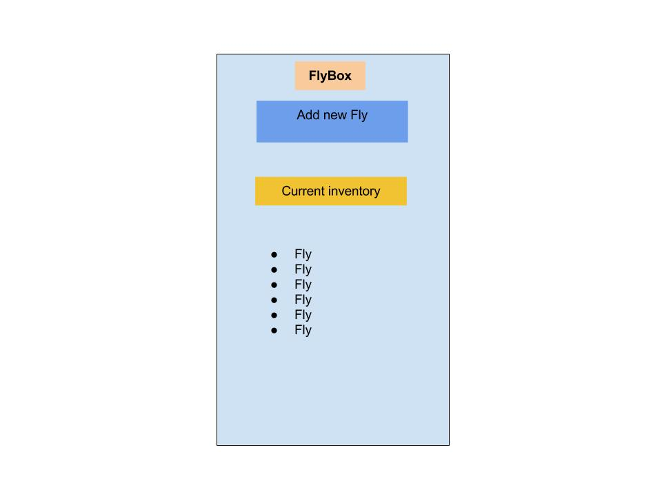

# FLYBOX

## User can add fly pictures and info from their collection to a database.  They can create a new fly and delete an old one.  User can attach a image url to the fly to display it on 2 pages.  The app is made for mobile views.

## Wireframe

